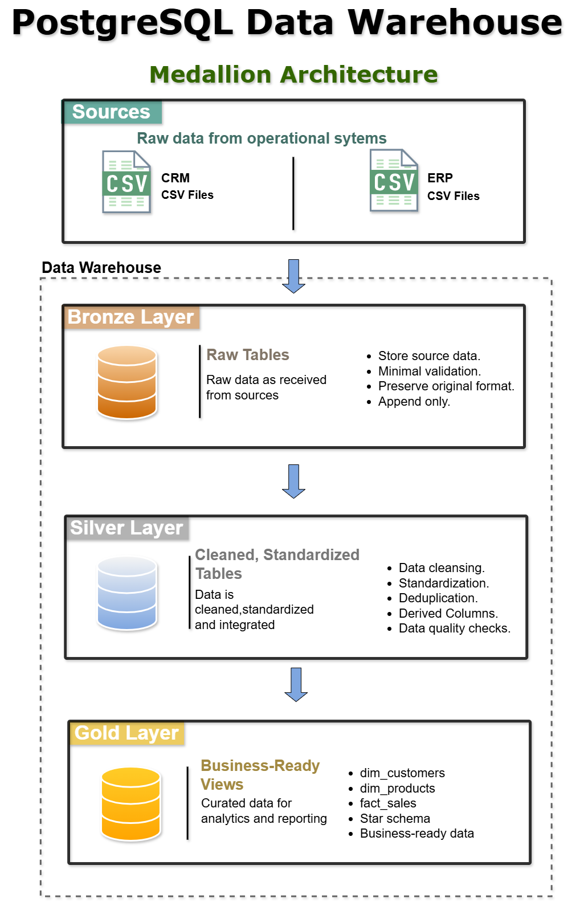
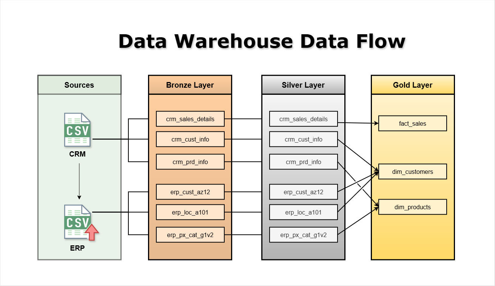
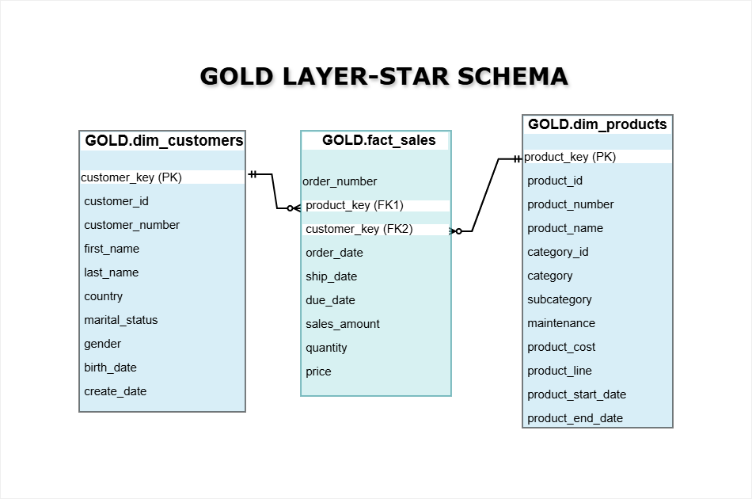

# PostgreSQL Data Warehouse

## 📌 Overview

A **PostgreSQL Data Warehouse** built using **Medallion Architecture (Bronze → Silver → Gold)** to transform raw CRM and ERP data into a clean, integrated, analytics-ready **Star Schema**.

The project covers data ingestion, data quality, SQL transformations, CRM/ERP integration, dimensional modeling, surrogate keys, and business-ready Gold-layer views.

---
## 🏗️ Data Architecture



---

## Data Flow



* **Bronze:** Raw CRM and ERP data loaded with minimal transformation.
* **Silver:** Cleansing, standardization, integration, transformation, and data-quality validation.
* **Gold:** Business-ready dimensional views for analytics.

---

## ⭐ Star Schema



The Gold layer contains:

* **`dim_customers`** — customer attributes
* **`dim_products`** — product and category attributes
* **`fact_sales`** — sales transactions and business measures

**Fact grain:** One row represents one product line within a sales order.

Dimension surrogate keys are used to connect the fact table with the corresponding dimensions.

---

## 🔍 Key Transformations

* CRM and ERP data integration
* Data cleansing and standardization
* Data-type conversion
* Date validation and transformation
* NULL and invalid-value handling
* Duplicate detection
* Sales and price validation
* Product validity-period calculation
* Dimension surrogate-key generation
* Business-ready Gold views

---

## 🧪 Data Quality

Data-quality checks were performed across the Bronze and Silver layers.

Examples include:

* Duplicate checks
* NULL checks
* Invalid-value checks
* Date validation
* CRM/ERP key matching
* Business-rule validation
* Record-count validation
* Fact-to-dimension relationship checks

---

## 🛠️ Tech Stack

* **Database:** PostgreSQL
* **Language:** SQL / PL/pgSQL
* **Tools:** pgAdmin, VS Code
* **Version Control:** Git, GitHub

---

## 📂 Project Structure

```text
postgres-data-warehouse/
│
├── data/
├── docs/
├── scripts/
├── sql/
│   ├── 01_schema/ 
│   ├── 02_bronze/
│   ├── 03_silver/
│   ├── 04_gold/
|   ├── 05_quality_checks/
├── LICENSE
└── README.md
```
---

## 📊 Dataset

This project uses sample CRM and ERP datasets containing customer,
product, and sales information.

---

## 🎯 Key Learning Outcomes

* Designed a multi-layer PostgreSQL Data Warehouse.
* Implemented Medallion Architecture.
* Built SQL-based ETL/ELT transformations.
* Applied data-quality validation.
* Integrated CRM and ERP source systems.
* Designed a Star Schema and defined fact-table grain.
* Implemented dimension surrogate keys.
* Created business-ready Gold-layer views.
* Worked with PostgreSQL SQL features and data types.

---

## License: 
MIT License for the original code and documentation created for this project. Third-party datasets and materials, if any, remain subject to their respective terms.

---

## 📚 Reference

This project was inspired by a SQL tutorial by Baraa Khatib Salkini.
The original tutorial was implemented using SQL Server, while this project
was independently rebuilt using PostgreSQL.
